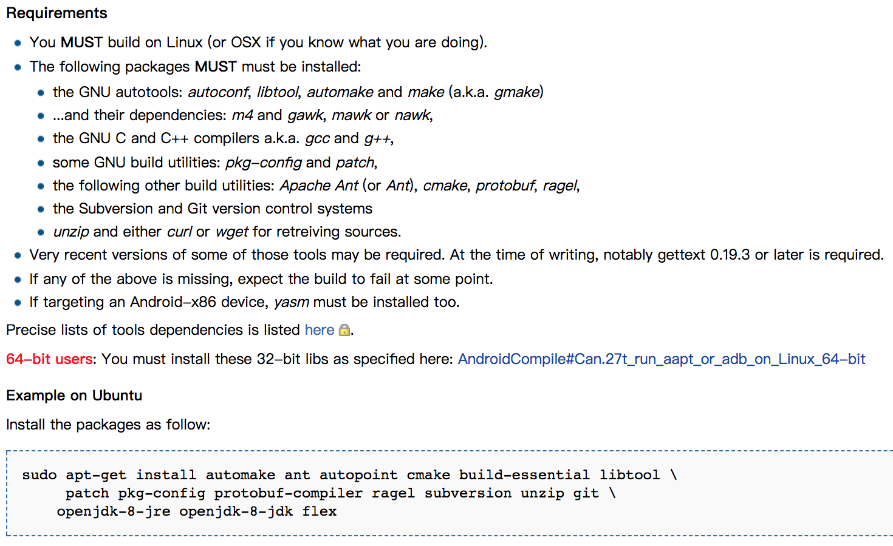
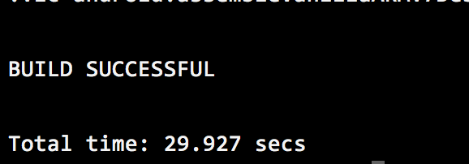

# vlc-for-android
> compile the vlc for android in ubuntu16.04

### 前言
> 该项目最新成功编译时间：20180301。期间我也遇到了不少的问题，然后一步一步解决到最后的成功。

### 准备工作

1.获取源码，可以到[官方源码](https://code.videolan.org/videolan/vlc-android)下载或者使用如下命令获取源码：
```
git clone https://code.videolan.org/videolan/vlc-android.git
```

然后按照[官方文档](https://wiki.videolan.org/AndroidCompile)对源码进行编译:
> PS:</br>
> 由于官方文档提供的是linux下的编译方式，我自己也尝试过win 7 + VM 14 + Ubuntu 16.4.01 的环境进行过编译，期间也遇到好多莫名其妙的问题，
> 但是只解决了一部分，另外一些不知道如何解决然后就放弃了，最后还是用mac去编译了，然后就有了这次的成果。
> 这部分的过程和期间遇到的问题，我也会在下面相关步骤地址提及一下，以方便需要的小伙伴少走些弯路。

2.设置环境变量：
```
export ANDROID_SDK=/path/to/android-sdk
export ANDROID_NDK=/path/to/android-ndk
export PATH=$PATH:$ANDROID_SDK/platform-tools:$ANDROID_SDK/tools
```

3. 一堆编译过程需要的工具</br>
</br>
```
//这里根据自己实际情况来安装，反正我不太懂，就全部安装了O(∩_∩)O哈哈哈~
brew install automake ant autopoint cmake build-essential libtool
brew install patch pkg-config protobuf-compiler ragel subversion unzip git
brew install openjdk-8-jre openjdk-8-jdk flex

brew install autoconf make  m4 gawk mawk gcc g++ cmake protobuf ragel
brew install curl wget gettext yasm 
```

### 正式编译

```
sh compile.sh -a armeabi-v7a
sh compile.sh -a arm64-v8a
sh compile.sh -a x86
sh compile.sh -a x86_64
sh compile.sh -a mips
sh compile.sh -a mips64
```

进入源码目录，终端输入 sh compile.sh 就可以开始编译啦</br>
最后编译成功</br>
</br>

### 相关文档
- [hanhailong/VCL-Android](https://github.com/hanhailong/VCL-Android)
- [Mac OS 下编译Vlc for android](https://www.jianshu.com/p/9b35e3fd2c8c)
> PS:我期间遇到有些问题的解决方法来自这篇文章，我就不重复了
- [官方sample](https://code.videolan.org/videolan/libvlc-android-samples)
> PS:我还没编译的时候就想直接使用该sample了，但是导入as就出错了，所示找不到 libvlc-3.0.0.aar 这个文件</br>
> </br>
> 当时我就崩溃了，然后去百度和Google找[这个文章](https://github.com/qdk0901/vlctest)，说是还是要编译成功该aar文件TAT
- [VLC核心LibVLC从源码下载、工程建立、实际使用一篇通](http://blog.csdn.net/Guofengpu/article/details/51470913)
- [vlc-android-lib 3.0.0-2.1.0 几乎支持所有格式文件的播放](http://blog.csdn.net/u014608640/article/details/52848499)
- [vlc_for_android(基于git-3.0.0)快速集成并播放电视节目直播](http://url.cn/521gb3T)
- [ubuntu 上编译vlc和debug](http://www.voidcn.com/article/p-uzbpdceh-vx.html)


